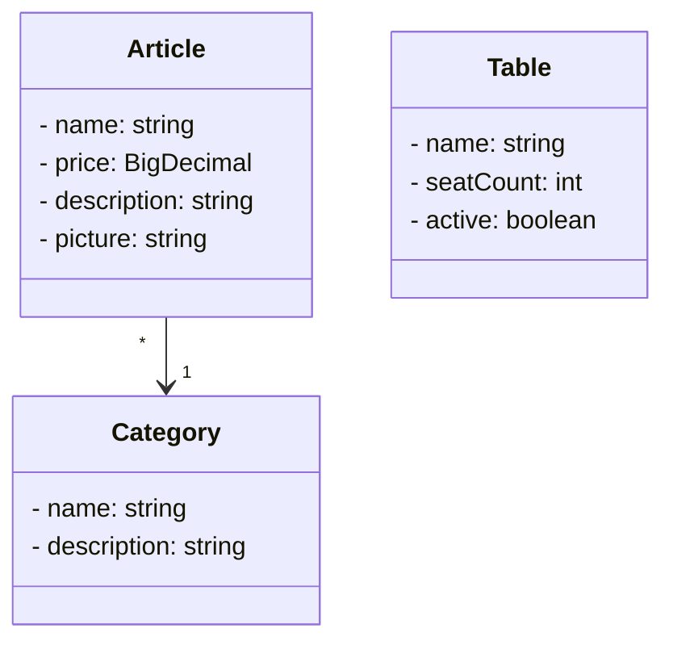

# Datamodel

```mermaid
classDiagram
    class Category {
        - name: string
        - description: string
    }
    
    class Article {
        - name: string
        - price: BigDecimal
        - description: string
        - picture: string
    }
    
    class Table {
        - name: string
        - seatCount: int
        - active: boolean
    }
    Article "*" --> "1" Category
```